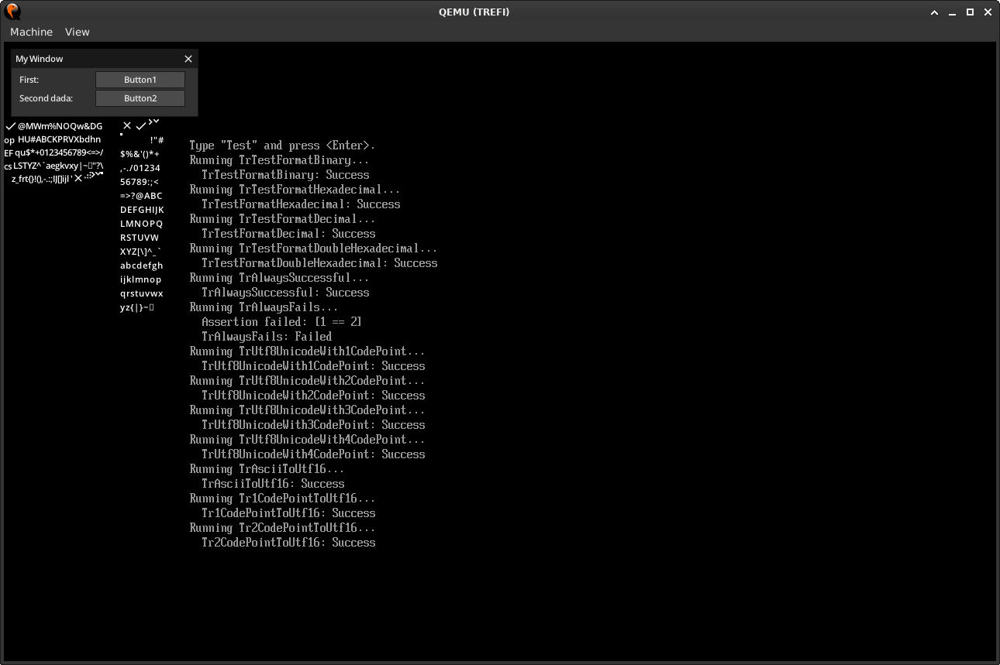

# UEFI project

First UEFI project with:
- a mini test framework (DONE),
- a custom printf/formatter (WIP 70%),
- a simple GUI using MicroUi (WIP 20%).

## See

- https://wiki.osdev.org/UEFI
- https://wiki.osdev.org/UEFI_From_Scratch
- https://wiki.osdev.org/UEFI_App_Bare_Bones
- https://github.com/utshina/uefi-simple/tree/master
- https://learn.microsoft.com/en-us/cpp/preprocessor/init-seg#example

# TODO

- OVMF CODE and VARS?
- QEMU `-machine q35`?
